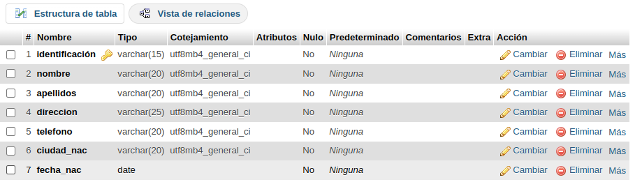
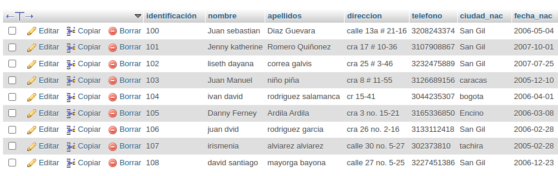

# INTRODUCCION A SQL

1. creacion de una base de datos (BD) con MySQL usando phpMYadin

### diccionario de datos 
|campo|tipo de dato|Longitud|
|-----|------------|--------|
|***identificacion**|varchar|15|
|nombre|varchar|20|
|apellidos|varchar|20|
|direccion|varchar|25|
|telefono|varchar|20|
|ciudad_nac|varchar|20|
|fecha_nac|date||

### diccionario de datos phpmyadmin

### registr de datos en tabla cliente

#### codigo sql de insercion de un  registro a la tabla de cliente

INSERT INTO `Cliente` (`identificación`, `nombre`, `apellidos`, `direccion`, `telefono`, `ciudad_nac`, `fecha_nac`) VALUES ('100', 'Juan sebastian', 'Diaz Guevara', 'calle 13a # 21-16', '3208243374', 'San Gil', '2006-09-04');

